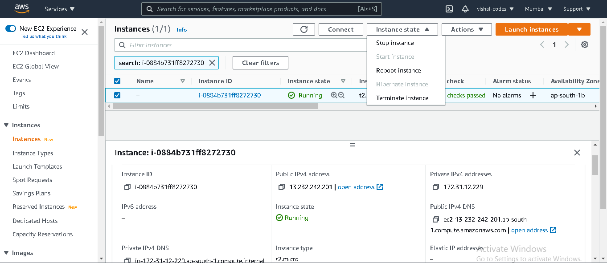

***Host Your Website in AWS***

***AWS***
***1. Sign in AWS***
*Create account in aws using gmail and sign in*

***2. AWS Management Console***
*Fisrt choose location , then go to EC2(Type of instance)- for creating instance(instance is type of os)*

***3. Lounch Instance***
*First you create or launch and instance for new project. when you create new project for that you create or launch new instance. for launch new instance click on launch instace*

***4. Choose Instace Type***
*After click launch instace then choose instace type or Amazon Machine Image in my project i choose ubuntu.
64bit(x86)*

***5. Choose Instace Type***
*Always choose General Purpose 12micro free tier eligible.
1.Click Next Configure Instace Details

2.Click Next Add Storage (Do not change any setting of Configure Instance Details)
3.Click Next Add Tags (Do add or change Add storage and if you want some extra storage for that click on Add New Valume button)
4.Click Next Configure Security Group (In Add Tags if you wnat to add tag add using Kay and value key - name and value - itme)
5.Click Review and Launch.(Before That Add Rule for website port when anyone wants to access your website so you give to access that user for that you add some Rule. If you want to change security group name you can change ,you also change description of security group. Click on Add Rule and select type HTTP , Source Anywhere , add click Review and launch. Note- also chnage SSH Source - Anywhere)

6.Click Launch (Before that check info you fill that was be correct or wronge if wronge change it)

7.Create new key pair and give name to it and then  download it. downloaded key pair present in download local storage. if key pair is lost we can not access to instace so manage it good way. Then click Launch Instaces button.(Scroll Down for Launch Instances)

8.Launch Status - Here you view your instace in running or not. Chick on hyper link that can form in numbers.

*

***6. Go To Terminal***
*1. Open Terminal - Go to download (cd down TAB) then checks your instace key is downloaded or not is present in download section.
2. Use Public ipv4 DNS - for connecting aws or ubuntu. for that type key pair file name and public ipv4 DNS.

then enter tab - type yes - you connected with ubuntu 

This is private ip of instance
3. Clone The Git Project - I clone this time Weather application

4. Install Nodejs to ubuntu and npm into ubuntu for that execute all commands of following step by step
- curl -sL https://deb.nodesource.com/setup_10.x | sudo bash -
- sudo apt-get install -y nodejs
- node -v
- npm install
- npm audit fix

5. Check node module folder is inside of you project folder
- ls 

-clear (for clear screen)
*

***7. Configure Security Groups***
*
1. change security groups -
project -> networking ->network interface (scroll left side) ->security groups -> edit inbounds rules -> custome anywhereip4 3000.

2. Add inbound Rules - Adding inbound rules for react port and you can add flask port also 3000 for react & 5000 for flask and ip4 anywhere and ip6 anywhere for both. save it 

*

***8. npm start ***
*
1. Go to terminal - check another node runing or not 
- ps -ef|grep node
- kill (4digitnumber)
2. Run react app -
- npm start

*

***8a. For Flask Run***
*
1. Open New Terminal
-cd dow Tab( Go to Download )
-ssh -i "keypair.pem" ubuntu@DNS address.ap-south-1.compute.amazonaws.com
-cd project_folder_name
-cd api_file_name
-$ python3 -V
-$ sudo apt install python3-venv
-$ mkdir flask_application && cd flask_application //optional we created
-$ python3 -m venv venv
-$ source venv/bin/activate
-(venv) $ pip install Flask
-(venv) $ python -m flask --version
-(venv) $ export flask_application(File Path)=my_app.py(File Name)  or  export FLASK_APP=hello.py
-(venv) $ flask run  --host=0.0.0.0
-pip uninstall bson
-pip uninstall pymongo
-pip install pymongo
-(venv) $ export flask_application(File Path)=my_app.py(File Name)  or  export FLASK_APP=hello.py
-(venv) $ flask run  --host=0.0.0.0
-pip install "pymongo[srv]"
-(venv) $ export flask_application(File Path)=my_app.py(File Name)  or  export FLASK_APP=hello.py
-(venv) $ flask run  --host=0.0.0.0
-(venv) $ deactivate
*

***9. Run on Browser***
*
1. Get Public ipv4 address and add port number
- 13.232.242.201:3000

2. Website View

*

***10. Stop Instances***
*
1. Go To AWS EC2

2. Stop Instaces

*

***11. Additional info***
*
1.Kill Process-
-ps -ef|grep node 
for checking bg react runing or not because you does not run some two process and similer port

-ps -ef|grep npm

-ps -ef|grep flask 
for checking bg flask runing or not because you does not run some two process and similer port

-kill flaskportnumber or nodenumber
for kill that bg runing process then run new react and flask command

2. Runing react and flask app in bg 

Create new screen
- screen -S tempreact
- npm start               (runing tempreact application in bg of ubuntu )
- ctrt+a+d                (for exit that screen)

check runing screen 
- screen -r 4digitnum.nameofscreen (eg screen -r 14022.temp1)
- ctr+c                   (it stop running)

check any screen running or not
- ps -ef|grep node
- kill 4digitnumber

for running again react app on bg ubuntu screen 
-screen -r 4digitnum.nameofscreen
-npm start                  (it start process)
-ctr+c                      (it stop process)

-screen -ls
for checking screen runing or not

for screen check runing or not
-screen -r 7491.react_bg
-then stop npm usinf ctr+c
-ctr+a+d

-screen -r 7491.flask_bg
-then ctr+c stop flask 
-ctr+a+d

-screen -ls 
 for checking screen runing or not

3. Change all local host to  public ipv4 (172.31.6.14:5000)
-for flask run change all local host to public ip of instances

App.js 'http://localhost:5000/ocean' ->'http://172.31.6.14:5000/ocean' -1
Capp.js 'http://localhost:5000/hoo' -> 'http://172.31.6.14:5000/ocean'
        'http://localhost:5000/'

Delete.jsx "http://localhost:5000/deletefacts" ->'http://172.31.6.14:5000/ocean'

Fapp.jsx "http://localhost:5000/addfacts" -> 'http://172.31.6.14:5000/ocean'

Update.jsx "http://localhost:5000/updatefacts" -> 'http://172.31.6.14:5000/ocean'

package.json "http://localhost:5000" -> 'http://172.31.6.14:5000/ocean'
*

